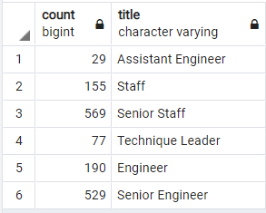

# Pewlett Hackard Analysis

## Overview of the analysis
The objective of this analysis is determine the number of retiring employees per title, and identify employees who are eligible to participate in a mentorship program. Then, we will write a report that summarizes your analysis and helps prepare Bobby’s manager for the “silver tsunami” as many current employees reach retirement age.  The following reports will be produced:

- The Number of Retiring Employees by Title
- The Employees Eligible for the Mentorship Program
- A written report on the employee database analysis
  
## Resources
- Data Source: departments.csv, dept_emp.csv, dept_manager.csv, employee.csv, salaries.csv, titles.csv
- Software: PostgreSQL, pgAdmin, VisualCode

## Results
The analysis of the Pewlett Hackard shows the following:

  - On number of retiring employees by title:
    1. Most of the retiring employees are engineers;
    2. Most of the retiring employees had achieved senior positions during their career
  
- Retiring Titles

  
 -  On employees eligible for the mentorship program:
    1. Most of th elegible employees are currently senior position;
    2. The numver of elegible employees are not enough to face the impact of the "silver tsunmai"
 
- Retiring Titles

 
## Summary

Based on the results above, we have reached the following conclusions:

  - As the "silver tsunami" begins to make an impact, 90,398 roles need to be filled
  - Code:
    SELECT SUM(rt.count)
    FROM retiring_titles AS rt;

  - There are only 1,549 enough qualified, retirement-ready employees in departments to mentor the next generation of Pewlett Hackard employees, which even been picked only within emplyees born in 1965, as shown in the table below:
  - Mentoring Titles

  - Code:
    SELECT COUNT(me.emp_no), me.title
    FROM mentorship_elegibility as me
    GROUP BY me.title;

    SELECT COUNT(me.emp_no)
    FROM mentorship_elegibility as me;
    

  
  
  
