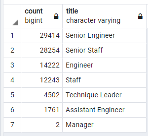

# Pewlett Hackard Analysis

## Overview of the analysis
The objective of this analysis is determine the number of retiring employees per title, and identify employees who are eligible to participate in a mentorship program. Then, we will write a report that summarizes your analysis and helps prepare Bobby’s manager for the “silver tsunami” as many current employees reach retirement age.  The following reports will be produced:

- The Number of Retiring Employees by Title
- The Employees Eligible for the Mentorship Program
- A written report on the employee database analysis
  
## Resources
- Data Source: departments.csv, dept_emp.csv, dept_manager.csv, employee.csv, salaries.csv, titles.csv
- Software: PostgreSQL, pgAdmin, VisualCode

## Results
The analysis of the Pewlett Hackard shows the following:

  - On number of retiring employees by title:
    1. Most of the retiring employees are engineers;
    2. Most of the retiring employees had achieved senior positions during their career
  
- Retiring Titles

  
 -  On employees eligible for the mentorship program:
    1. Most of th elegible employees are currently senior position;
    2. The number of elegible employees are not enough to face the impact of the "silver tsunmai"
 
- Retiring Titles
	
 
## Summary

Based on the results above, we have reached the following conclusions:

  - As the "silver tsunami" begins to make an impact, 90,398 roles need to be filled
    
    - Code:
    
      SELECT SUM(rt.count)
      FROM retiring_titles AS rt;

  - There are only 1,549 enough qualified, retirement-ready employees in departments to mentor the next generation of Pewlett Hackard employees, which even been picked only within emplyees born in 1965, as shown in the table below:
  - Mentoring Titles
  
	

    - Code:
    
      SELECT COUNT(me.emp_no), me.title
      FROM mentorship_elegibility AS me
      GROUP BY me.title;

      SELECT COUNT(me.emp_no)
      FROM mentorship_elegibility AS me;
      
## Code

SELECT e.emp_no, e.first_name, e.last_name, t.title, t.from_date, t. to_date
INTO retirement_titles
FROM employees as e
INNER JOIN titles as t
ON e.emp_no = t.emp_no
WHERE (e.birth_date BETWEEN '1952-01-01' AND '1955-12-31')
ORDER BY e.emp_no;

select * from retirement_titles;

-- Use Dictinct with Orderby to remove duplicate rows
SELECT DISTINCT ON (rt.emp_no) rt.emp_no,
rt.first_name,
rt.last_name,
rt.title
INTO unique_titles
FROM retirement_titles as rt
ORDER BY rt.emp_no, rt.to_date DESC;

SELECT * FROM unique_titles

SELECT COUNT(ut.title), ut.title
INTO retiring_titles
FROM unique_titles AS ut
GROUP BY ut.title
ORDER BY count DESC;

SELECT DISTINCT ON(e.emp_no) e.emp_no, e.first_name, e.last_name, e.birth_date,
	de.from_date, de.to_date,
	t.title
INTO mentorship_elegibility
FROM employees AS e
INNER JOIN dept_emp AS de
ON e.emp_no = de.emp_no
INNER JOIN titles AS t
ON e.emp_no = t.emp_no
WHERE (e.birth_date BETWEEN '1965-01-01' AND '1965-12-31')
	AND (de.to_date = '9999-01-01')
ORDER BY e.emp_no, de.to_date DESC, t.to_date DESC;

select * from mentorship_elegibility

SELECT SUM(rt.count)
FROM retiring_titles AS rt;

SELECT COUNT(me.emp_no), me.title
FROM mentorship_elegibility as me
GROUP BY me.title;

SELECT COUNT(me.emp_no)
FROM mentorship_elegibility as me;

    

  
  
  
